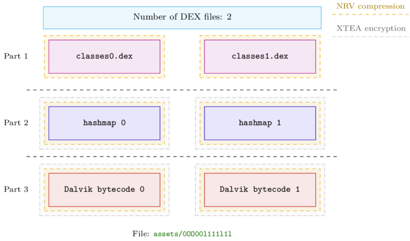
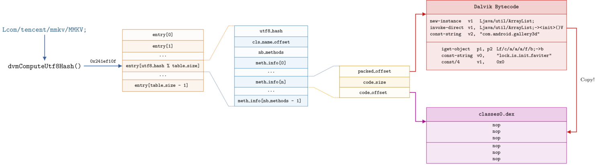

# Legu Unpacker

Scripts to unpack Android applications protected by Tencent Legu. It only works with versions
**4.1.0.15** and **4.1.0.18** of Legu.

Blog post: https://blog.quarkslab.com/a-glimpse-into-tencents-legu-packer.html

## Overview

The original DEX files are located in ``assets/0OO00l111l1l`` with the following layout:

<p align="center" >
<br />
</p>

One can find the details of this structure in the Kaitai file: [legu_packed_file.ks](./legu_packed_file.ksy)

The *hashmap* embedded in the second part is described in the [legu_hashmap.ks](./legu_hashmap.ksy) file:

<p align="center" >
<br />
</p>

## pylegu

[pylegu](./pylegu) contains the Python bindings to decrypt and uncompress the data embedded in ``assets/0OO00l111l1l``.

To compile and install ``pylegu``:

```bash
$ cd pylegu
$ python3 ./setup.py build -j4 install --user
$ python -c "import pylegu"
```
Looks like -std default got bumped up to either c99 or c11 with newer gcc releases
To fix whether your compiler passes the ACC conformance test... FAILED and rebuild again
```bash
$ export CFLAGS="$CFLAGS -std=c90 -fPIC"
$ python3 ./setup.py build -j4 install --user
$ python -c "import pylegu"
```

One could also use [jap/pyucl](https://github.com/jap/pyucl) to decompress the data and [aguinet/dragonffi](https://github.com/aguinet/dragonffi) to bind the custom implementation of XTEA.

## Get Started

The sample [com.intotherain.voicechange.apk](./samples/com.intotherain.voicechange.apk) is a [suspicious application](https://www.virustotal.com/gui/file/708e6967920dcf2789b7183d714e73ab79a2f8b3ca71929b12aadeb2c58c2867/detection)
that can be unpacked as follows:

```bash
$ python ./unpack.py ./samples/com.intotherain.voicechange.apk

[+] Legu version: 4.1.0.15
[+] Password is 'IPk2Hw7AKTuIQBlc'
[+] Number of dex files: 1
[+] Unpacking #1 DEX files ...
[+] dex 0 compressed size:   0x1619a3
[+] dex 0 uncompressed size: 0x5671f8

[+] Unpacking #1 hashmap ...
[+] hashmap 0 compressed size:   0x4399c
[+] hashmap 0 uncompressed size: 0x95558

[+] Unpacking #1 packed methods ...
[+] packed methods 0 compressed_size:   0xf4636
[+] packed methods 0 uncompressed_size: 0x1e3072

[+] Stage 2: Patching DEX files
[+] Unpacked APK: unpacked.apk
```

The unpacked DEX files are located in the ``unpacked.apk`` file.

## Requirements

- Python >= 3.7
- Kaitai Struct
- LIEF
- pylegu


